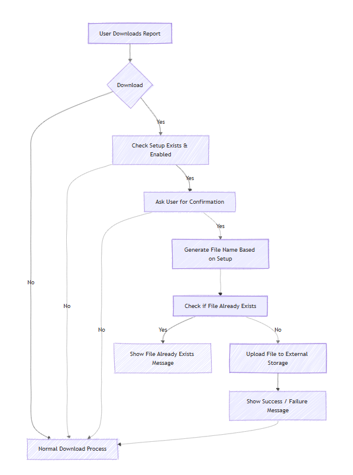

# 🚀 Store In External Storage

This extension allows users to **store reports and files directly in external storage** from Business Central, with **customizable file naming conventions** and **automatic handling of download events**.



---

## 📌 Features

- ✅ **Automatic storage of reports**: When a report is downloaded, the user can optionally store it directly in an external folder.  
- ✅ **Customizable file naming**: Supports default, date-based, datetime-based, and fully customizable naming patterns.  
- ✅ **Prefix, suffix, and file extension support**: Add static text or set default file extensions for all files.  
- ✅ **Manual upload action**: Upload any file to external storage from the setup page.  
- ✅ **Integrated with standard External File Storage codeunit**: Uses Microsoft’s built-in file storage functionality for compatibility and reliability.

---

## 📂 Table: `Store In External Storage Set.`

| Field | Type | Description |
|-------|------|-------------|
| Primary Key | Code[10] | Unique identifier for the setup record. |
| Enabled | Boolean | Whether this setup is active. Only active setups are used. |
| Store Path | Text[2048] | Folder path where files will be stored. |
| File Naming Convention | Enum | Format of the file name (Date, DateTime, Custom Pattern, etc.). |
| Custom Pattern | Text[100] | Custom naming pattern with placeholders: `{Date}`, `{Time}`, `{DateTime}`. |
| File Prefix | Text[50] | Optional prefix for file names. |
| File Suffix | Text[50] | Optional suffix before the file extension. |
| Default File Extension | Text[10] | Default extension to use when saving the file (e.g., PDF, TXT, CSV). |

---

## 🖥 Page: `Store In External Storage Set.`

- Card page to **configure external storage settings**.  
- Groups fields into **General** and **Naming** sections.  
- **Upload** action allows manual file uploads.  
- `OnAssistEdit` on `Store Path` opens folder selection using External File Storage codeunit.  
- Auto-creates a setup record if none exists.

---

## 📦 Codeunit: `Store In External Storage Mang`

Handles the logic of storing files:

- **Event Subscribers**:
  - `GetFilename` – Captures file names when reports are downloaded.  
  - `OnDocumentReady` – Saves downloaded reports to external storage after user confirmation.
- **Procedures**:
  - `SaveInExternalStorage` – Uploads a file to external storage with validation.  
  - `GenerateFileName` – Generates a file name according to selected naming convention.  
  - `ApplyCustomFilePattern` – Replaces placeholders in a custom pattern with actual date/time values.  

---

## 🧩 Enum: `File Naming Convention`

| Value | Caption | Description |
|-------|--------|-------------|
| Default | Default | Keeps the original file name. |
| Date (YYYYMMDD) | Date (YYYYMMDD) | Adds date in `YYYYMMDD` format. |
| Date (DDMMYYYY) | Date (DDMMYYYY) | Adds date in `DDMMYYYY` format. |
| Date (DDMMMYYYY) | Date (DDMMMYYYY) | Adds date in `DDMMMYYYY` format (e.g., 30Aug2025). |
| Date (MMYYYY) | Date (MMYYYY) | Adds month and year (e.g., 082025). |
| DateTime | DateTime (YYYYMMDD_HHmmss) | Adds date and time in `YYYYMMDD_HHmmss` format. |
| Custom Pattern | Custom Pattern | Allows custom naming with placeholders (`{Date}`, `{Time}`, `{DateTime}`). |

---

## 🗂 Enum Extension: `File Scenario`

- Adds a new scenario for external storage:  
  - `"Store In External Storage"` – used to initialize the External File Storage codeunit for this extension.  

---

## 🔑 Permission Set: `Store In Ext Storage`

- Provides access to:
  - `Store In External Storage Set.` table (RIMD)  
  - `Store In External Storage Mang` codeunit (Execute)  

---

## ⚙️ Usage

1. **Configure Setup**
   - Open the **Store In External Storage Setup** page.  
   - Enable the setup.  
   - Define a store path, file naming convention, prefix/suffix, and default extension.  
   - Optionally, define a custom pattern with placeholders.  

2. **Download Reports**
   - When downloading a report, the system will ask for confirmation to **store the file in external storage**.  
   - The file is saved automatically with the configured file name and path.

3. **Manual Upload**
   - Use the **Upload** action on the setup page to manually upload files to external storage.  

---

## 📝 Example Custom Pattern

```text
INV_{Date}_{Time}
```
Will generate: INV_20250830_142315.pdf

Uses the actual date and time at the moment of file storage.